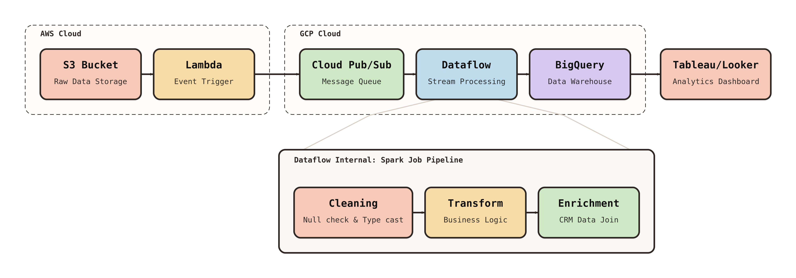
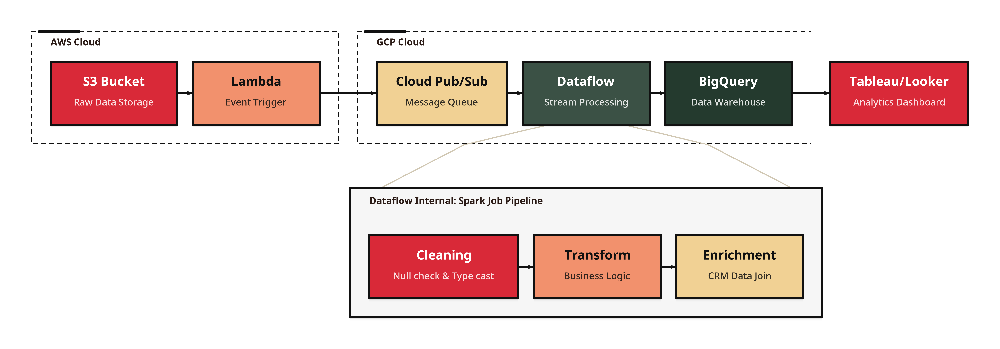
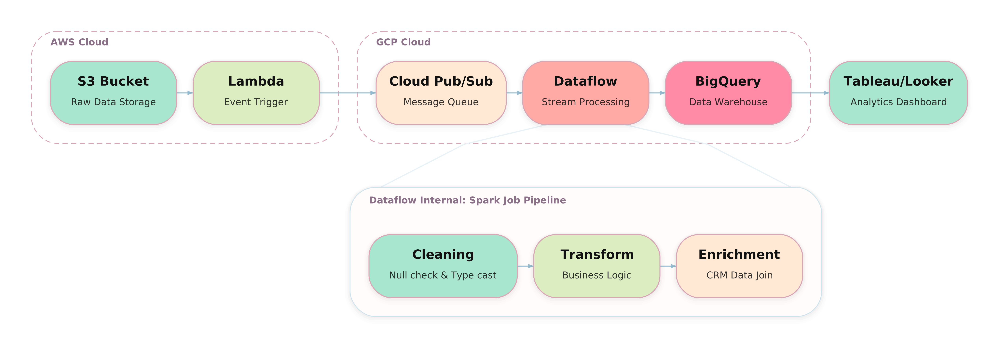
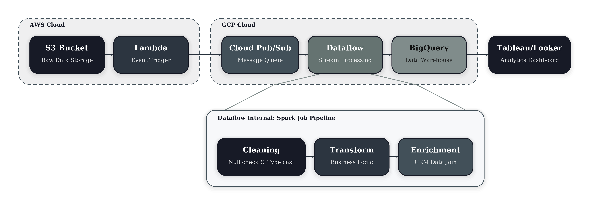
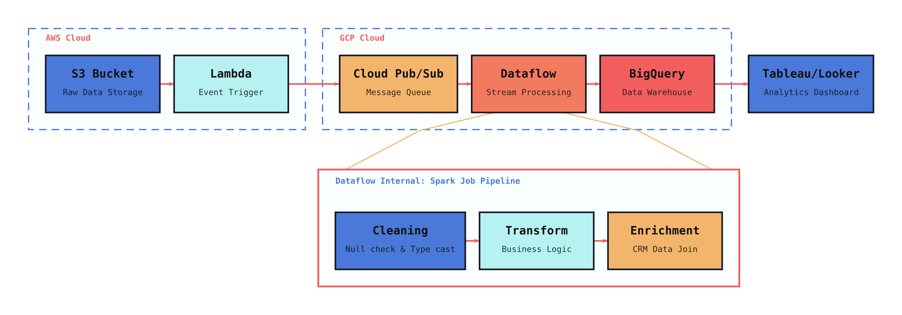
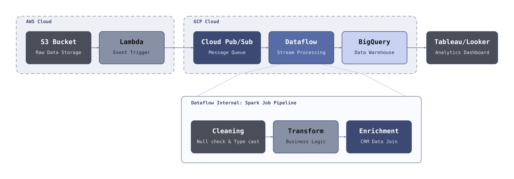
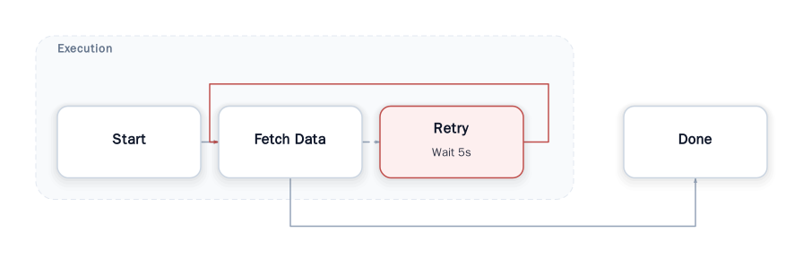

# frameplot

[](https://pypi.org/project/frameplot/)
[](https://pypi.org/project/frameplot/)
[](https://github.com/smturtle2/frameplot/actions/workflows/workflow.yml)
[](https://github.com/smturtle2/frameplot/blob/main/LICENSE)

파이썬 코드로 정의한 파이프라인 그래프를 발표용 SVG와 PNG 다이어그램으로 변환합니다.

[English README](https://github.com/smturtle2/frameplot/blob/main/README.md)



`frameplot`은 왼쪽에서 오른쪽으로 흐르는 파이프라인 다이어그램을 깔끔한 기본값으로 렌더링하는 경량 파이썬 라이브러리입니다. 노드, 엣지, 그룹, 그리고 선택적인 detail panel을 파이썬 데이터 구조로 정의한 뒤, 문서용 SVG나 고해상도 발표 자료용 PNG로 바로 내보낼 수 있습니다.

## 테마 갤러리

모든 내장 프리셋은 흰 캔버스 위에 렌더됩니다. 같은 hero 파이프라인을 각 테마로 한 번씩 렌더해 바로 비교할 수 있게 정리했습니다.

| Soft Retro | Retro | Pastel |
| --- | --- | --- |
|  |  |  |

| Dark | Cyberpunk | Monochrome |
| --- | --- | --- |
|  |  |  |

## 특징

- **깔끔하고 전문적인 결과물**: 현대적인 기본값을 제공하는 좌에서 우 방향의 아키텍처 다이어그램.
- **Diagram as Code**: 파이썬 코드로 파이프라인을 정의하고, 결정적인 SVG/PNG 결과물을 얻습니다.
- **상세 패널 (Detail Panel)**: 요약 노드를 하단 inset 미니 그래프로 확장하여 세부 로직을 명확히 설명하는 독보적인 기능.
- **강력한 커스터마이징**: `Theme`을 통해 폰트, 간격, 색상, 모서리 곡률(radius) 등을 정밀하게 조정 가능.
- **화이트 캔버스 테마**: 내장 프리셋이 기본적으로 흰 배경 위에 렌더되어 문서와 슬라이드에 바로 붙일 수 있습니다.
- **발표 및 문서 최적화**: 웹용 고해상도 SVG와 슬라이드/논문용 PNG 출력을 지원합니다.

## 설치

```bash
python -m pip install frameplot
```

PNG 출력은 CairoSVG에 의존하며, 환경에 따라 Cairo 또는 libffi 시스템 패키지가 필요할 수 있습니다.

## 빠른 시작

```python
from frameplot import Edge, Group, Node, Pipeline

pipeline = Pipeline(
    nodes=[
        Node("start", "Start", "Receive request"),
        Node("fetch", "Fetch Data", "Load source tables"),
        Node("retry", "Retry", "Loop on transient failure", fill="#FFF2CC"),
        Node("done", "Done", "Return result", fill="#D9EAD3"),
    ],
    edges=[
        Edge("e1", "start", "fetch"),
        Edge("e2", "fetch", "retry", dashed=True),
        Edge("e3", "retry", "fetch", color="#C0504D"),
        Edge("e4", "fetch", "done"),
    ],
    groups=[
        Group("g1", "Execution", ["start", "fetch", "retry"], edge_ids=["e2"]),
    ],
)

svg = pipeline.to_svg()
pipeline.save_svg("pipeline.svg")
pipeline.save_png("pipeline.png")
```



## 공개 API

공식적으로 지원하는 공개 API는 top-level import 기준입니다.

- `Node(id, title, subtitle=None, fill=None, stroke=None, text_color=None, metadata=None, width=None, height=None)`
- `Edge(id, source, target, color=None, dashed=False, metadata=None)`
- `Group(id, label, node_ids, edge_ids=(), stroke=None, fill=None, metadata=None)`
- `DetailPanel(id, focus_node_id, label, nodes, edges, groups=(), stroke=None, fill=None, metadata=None)`
- `Theme(...)`
- `Pipeline(nodes, edges, groups=(), detail_panel=None, theme=None)`

`Pipeline` 메서드:

- `to_svg() -> str`
- `save_svg(path) -> None`
- `to_png_bytes(scale=4.0) -> bytes`
- `save_png(path, scale=4.0) -> None`

## 고급 예제: 멀티 클라우드 데이터 파이프라인

상단 hero 이미지와 위의 테마 갤러리는 [`examples/theme_heroes.py`](https://github.com/smturtle2/frameplot/blob/main/examples/theme_heroes.py)에서 생성되며, 공통 파이프라인 정의는 [`examples/hero_pipeline.py`](https://github.com/smturtle2/frameplot/blob/main/examples/hero_pipeline.py)에 있습니다. 함께 다음과 같은 특징을 보여줍니다:

- **클라우드 간 연결**: AWS(S3/Lambda)에서 GCP(Pub/Sub/Dataflow) 서비스로 이어지는 복잡한 흐름 시각화.
- **컨텍스트 유지**: `DetailPanel`을 사용하여 "Dataflow" 노드 내부의 Spark Job 파이프라인을 메인 흐름을 방해하지 않고 상세 설명.
- **소프트 레트로 스타일링**: 흰 캔버스 위에 `Theme.soft_retro()` 프리셋을 적용한 대표 예제입니다.

## 참고 사항

- v0.x에서는 좌에서 우 레이아웃만 지원합니다.
- edge label은 아직 지원하지 않습니다.
- 그룹은 시각적 오버레이이며, grouped node를 드나드는 라우트는 그룹 바깥에서 bend합니다.
- detail panel은 메인 플로우 아래쪽의 별도 inset 블록으로 렌더링됩니다.

## 개발

```bash
python -m venv .venv
source .venv/bin/activate
python -m pip install -e '.[dev]'
python -m pytest -q
```

배포는 GitHub Actions와 PyPI Trusted Publishing으로 자동화합니다. `pyproject.toml`의 버전을 올린 뒤 `v0.4.0` 같은 태그를 푸시하면 `.github/workflows/workflow.yml`에서 릴리스가 시작됩니다.
