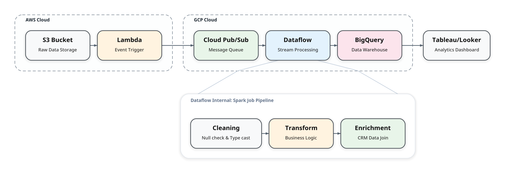
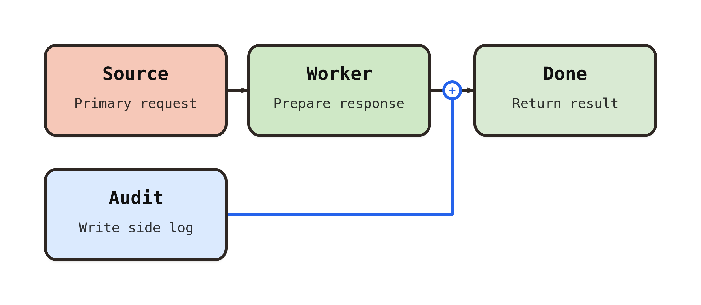

# frameplot

[](https://pypi.org/project/frameplot/)
[](https://pypi.org/project/frameplot/)
[](https://github.com/smturtle2/frameplot/actions/workflows/workflow.yml)
[](https://github.com/smturtle2/frameplot/blob/main/LICENSE)

Turn Python-defined pipeline graphs into presentation-ready SVG and PNG diagrams.

[한국어 README](https://github.com/smturtle2/frameplot/blob/main/README.ko.md)


`frameplot` is a compact Python library for rendering left-to-right pipeline diagrams with clean defaults. Define nodes, edges, groups, and optional detail panels in plain Python, then export polished SVG for documentation or high-resolution PNG for slides and papers.

## Theme Gallery

All built-in presets stay on a white canvas. The same hero pipeline is rendered below once per theme so you can compare them directly.

| Soft Retro | Retro |
| --- | --- |
|  |  |

| Research | Dark |
| --- | --- |
|  |  |

| Cyberpunk | Monochrome |
| --- | --- |
|  |  |

## Why frameplot?

- **Clean and Professional**: Left-to-right architecture diagrams with modern defaults.
- **Diagram as Code**: Define your pipeline in Python, get deterministic SVG/PNG outputs.
- **Detail Panels**: Unique feature to expand a summary node into a lower inset mini-graph for deep dives.
- **Deep Customization**: Fine-tune typography, spacing, colors, and corner radii via `Theme`.
- **White-Canvas Themes**: Built-in presets stay presentation-friendly on white backgrounds.
- **Presentation Ready**: High-quality SVG for web/docs and PNG for slides or papers.

## Install

```bash
python -m pip install frameplot
```

PNG export depends on CairoSVG and may require Cairo or libffi packages from the host OS.

## Quickstart

```python
from frameplot import Edge, Group, Node, Pipeline

pipeline = Pipeline(
    nodes=[
        Node("start", "Start", "Receive request"),
        Node("fetch", "Fetch Data", "Load source tables"),
        Node("retry", "Retry", "Loop on transient failure", fill="#FFF2CC"),
        Node("done", "Done", "Return result", fill="#D9EAD3"),
    ],
    edges=[
        Edge("e1", "start", "fetch"),
        Edge("e2", "fetch", "retry", dashed=True),
        Edge("e3", "retry", "fetch", color="#C0504D"),
        Edge("e4", "fetch", "done"),
    ],
    groups=[
        Group("g1", "Execution", ["start", "fetch", "retry"], edge_ids=["e2"]),
    ],
)

svg = pipeline.to_svg()
pipeline.save_svg("pipeline.svg")
pipeline.save_png("pipeline.png")
```


## Edge-to-Edge Joins

```python
from frameplot import Edge, Node, Pipeline

pipeline = Pipeline(
    nodes=[
        Node("source", "Source", "Primary request"),
        Node("worker", "Worker", "Prepare response"),
        Node("audit", "Audit", "Write side log", fill="#DBEAFE"),
        Node("done", "Done", "Return result", fill="#D9EAD3"),
    ],
    edges=[
        Edge("e1", "source", "worker"),
        Edge("e2", "worker", "done"),
        Edge("e3", "audit", "e2", merge_symbol="+", color="#2563EB"),
    ],
)
```



## Public API

Top-level imports are the supported public API:

- `Node(id, title, subtitle=None, fill=None, stroke=None, text_color=None, metadata=None, width=None, height=None)`
- `Edge(id, source, target, color=None, dashed=False, merge_symbol=None, metadata=None)`
- `Group(id, label, node_ids, edge_ids=(), group_ids=(), stroke=None, fill=None, metadata=None)`
- `DetailPanel(id, focus_node_id, label, nodes, edges, groups=(), stroke=None, fill=None, metadata=None)`
- `Theme(...)`
- `Pipeline(nodes, edges, groups=(), detail_panel=None, theme=None)`

`Edge.target` may reference either a node id or another edge id. When targeting another edge, `merge_symbol="+"` or `"x"` renders a join badge at the merge point.

`Pipeline` exposes:

- `to_svg() -> str`
- `save_svg(path) -> None`
- `to_png_bytes(scale=4.0) -> bytes`
- `save_png(path, scale=4.0) -> None`

## Modeling Guidance

- Keep the main graph at one abstraction level. Frameplot lays the pipeline out as a dependency-driven left-to-right graph, not as a freeform block diagram.
- Use `DetailPanel` for repeated block internals or per-stage mechanics that would otherwise create long-range edges in the main graph.
- Use `Group` as a structural container for nearby related nodes. Prefer explicit nesting with `group_ids`; legacy strict-subset node groups are still normalized into a tree for compatibility.
- Keep group membership tree-shaped. A node can belong to one direct parent group, and a child group can belong to one direct parent group.

## Advanced Example: Multi-cloud Data Pipeline

The hero image at the top and the theme gallery above are generated from [`examples/theme_heroes.py`](https://github.com/smturtle2/frameplot/blob/main/examples/theme_heroes.py), using the shared pipeline definition in [`examples/hero_pipeline.py`](https://github.com/smturtle2/frameplot/blob/main/examples/hero_pipeline.py). Together they showcase:

- **Complex Routing**: Seamlessly connecting AWS (S3/Lambda) to GCP (Pub/Sub/Dataflow) services.
- **Contextual Details**: Using a `DetailPanel` to explain the internal Spark Job Pipeline of the "Dataflow" node.
- **Soft Retro Styling**: Applying the built-in `Theme.soft_retro()` preset on a white canvas.

## Design Notes

- Layout is intentionally left-to-right in v0.x.
- Edge labels are not supported yet, but edge-to-edge joins can render optional `+` / `x` badges.
- Groups with `node_ids` or `group_ids` are structural container blocks in layout, while edge-only groups remain visual highlights.
- Detail panels render as separate lower insets attached to a focus node in the main flow.
- If a sample looks stretched or routes far outside the intended block, the graph usually mixes stage-level flow with internal logic in one plane; move the internals into a `DetailPanel`.

## Development

```bash
python -m venv .venv
source .venv/bin/activate
python -m pip install -e '.[dev]'
python -m pytest -q
```

Release publishing is automated through GitHub Actions and PyPI Trusted Publishing. Bump the version in `pyproject.toml`, create a tag like `v0.4.0`, and push the tag to trigger a release from `.github/workflows/workflow.yml`.
